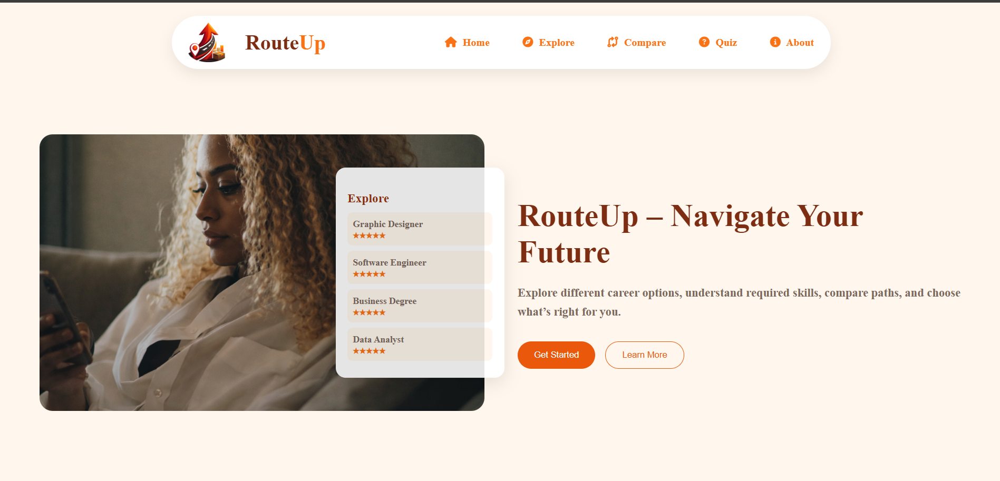
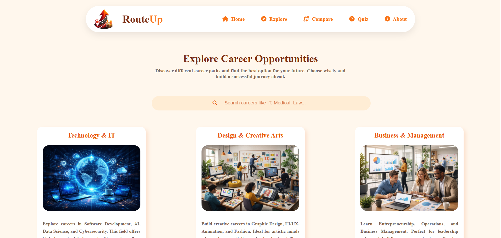
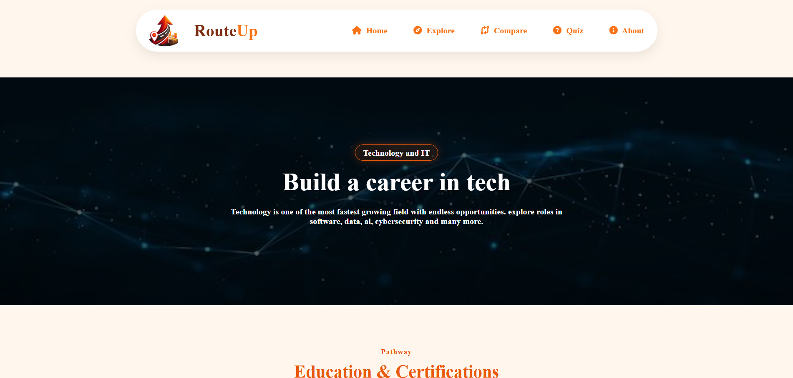

# RouteUp – Navigate Your Future

This project is a responsive and modern website built using HTML and CSS. It focuses on clean design, user-friendly layout, and visually appealing components.

## 🔗 Live Website
https://routeup-navigate-your-future.netlify.app/

## 📸 Screenshots

###  Home Page

### Explore page

### it page

## 📌 Features
- Quick quiz
- Carrier compare
- Proper carrier Guidnce
- Deployed on Netlify

## 🛠️ Technologies Used
- HTML5
- css
- Netlify

## 🎯 Objective
To help users choose the right career through personalized guidance and clear comparisons.

## 🤝 Contributors 

